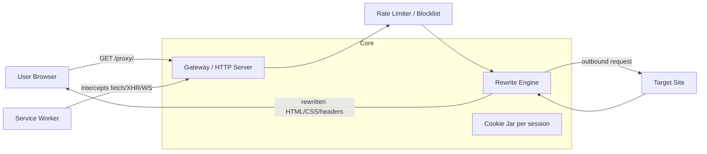

# prism-proxy — Planning

## What it is

A web proxy site: the user enters a URL, our server fetches the page, rewrites
every reference (links, assets, redirects, forms) to point back through the
proxy, and serves the result. All subsequent browsing stays inside the proxy.

## Stack

- **Node.js + TypeScript** — the mature ecosystem for this category
  (Ultraviolet, Scramjet, Rammerhead) is JS-based, and client-side request
  interception requires a Service Worker anyway.
- **Fastify** — HTTP server.
- **cheerio** — HTML rewriting (v0.1). May swap to a streaming parser later.
- **undici** — outbound requests.
- **Vitest** — tests.

## Architecture

### Modules

| Module                | Responsibility                                                        |
| --------------------- | --------------------------------------------------------------------- |
| `src/proxy.ts`        | Routes: landing page, `/go` redirect, `/proxy/:token` gateway          |
| `src/codec.ts`        | URL token encode/decode — every reference round-trips through this     |
| `src/rewrite/html.ts` | HTML attribute rewriting (`href`, `src`, `srcset`, meta refresh, etc.) |
| `src/rewrite/css.ts`  | CSS `url()` / `@import` rewriting                                      |
| `src/rewrite/headers.ts` | Strip CSP/XFO/HSTS, rewrite `Location` redirects                    |
| `src/config.ts`       | Env-based config incl. SSRF blocklist                                  |

### Planned (not yet built)

- **Service worker** — intercepts dynamic `fetch`/`XHR`/WebSocket from proxied
  pages. The single biggest compatibility lever for modern JS-heavy sites.
- **Session/cookie jar** — per-session cookie storage so users don't share
  login state on the same target site.
- **Rate limiting + blocklist hooks** — must be designed in from day one;
  public proxies attract abuse (phishing through your domain, scraping).

## Roadmap

| Milestone | Contents |
| --------- | -------- |
| **v0.1 MVP** | GET proxying, HTML/CSS rewriting, header sanitization, Docker deploy |
| **v0.2** | POST + forms, cookie jar, redirects, gzip/brotli, rate limiting |
| **v0.3** | Service worker interception, WebSocket proxying, real frontend UI |
| **v0.4** | Media streaming, `<iframe>` support, JS rewriting |
| **v1.0** | Hardening, docs, plugin API, stable release |

## Testing strategy

Tests are the moat. Build a fixture site covering: relative URLs,
protocol-relative `//` URLs, `srcset`, meta refresh, JS `location` assignment,
cookies with Domain/Path, redirect chains. `test/` already covers the rewrite
engine; integration tests against a local fixture server come with v0.2.

## Threat model (plan ahead)

- **SSRF** — the gateway fetches arbitrary URLs; block private ranges and
  cloud metadata endpoints before any public deploy.
- **Abuse** — someone *will* use a public instance for phishing/scraping.
  Write the abuse and logging policy before launching, not after.
- **Content liability** — your domain serves third-party content; consider
  robots handling, takedown contact in README/SECURITY, and ToS.

## Community setup

- License: **AGPL-3.0-only** (hosted forks must publish source).
- CI: lint, typecheck, tests, build on every PR (see `.github/workflows`).
- Issue/PR templates, `good first issue` labels, CONTRIBUTING, CoC, SECURITY.
